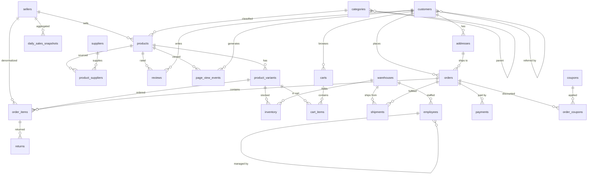

# Data Model

The SQL Learning Lab uses a **multi-seller e-commerce marketplace** schema with ~24 tables
designed to make every item of the SQL learning checklist practicable.

## ER Diagram

## Tables

| Table | Purpose | SQL features it teaches |
|---|---|---|
| `sellers` | Marketplace sellers with ratings & commission | Aggregation, filtering, Decimal math |
| `customers` | Buyers with loyalty tiers, tags, preferences, referrals | Self-reference (recursive CTE), jsonb, arrays, soft-delete |
| `addresses` | Customer billing/shipping addresses | Enums, 1:N, filtering |
| `categories` | Product category tree (3–4 levels) | Self-reference, recursive CTE with depth/path |
| `products` | Catalog items with jsonb attributes, FTS | Full-text search (tsvector), jsonb ops, GIN indexes, NULLs |
| `product_variants` | SKU-level variants (size/color) | Unique constraints, price math |
| `suppliers` | Product sources with lead times | Filtering, joins |
| `product_suppliers` | M:N products↔suppliers with payload | Composite PK, M:N with payload, unit cost |
| `warehouses` | Fulfilment locations | Filtering, joins |
| `inventory` | Stock per variant per warehouse | Composite PK, stock calculations |
| `orders` | Customer orders with status, currency, channel | Enums, status filtering, date range, partial index |
| `order_items` | Line items with generated `line_total` column | Generated columns, denormalized seller_id, aggregation |
| `payments` | Order payments (multiple per order) | Row multiplication trap, installments |
| `shipments` | Delivery tracking with timestamps | Interval/lead-time arithmetic, NULL delivered_at |
| `returns` | Item returns with reasons & refunds | Partial refunds, status coherence |
| `coupons` | Discount codes with validity windows | Date range checks, percent/fixed |
| `order_coupons` | M:N orders↔coupons | M:N with payload |
| `reviews` | Product ratings (1–5) with CHECK | CHECK constraints, NULL body, aggregation |
| `employees` | Staff with manager chain (4–5 levels) | Self-reference, recursive CTE, hierarchy |
| `carts` / `cart_items` | Session carts, mostly abandoned | Anti-join, funnel analysis, conversion |
| `page_view_events` | Time-series clickstream (BigInt id) | Window functions, sessionization, funnels, LAG/LEAD |
| `exchange_rates` | Currency rates by date range | Range/non-equi joins, multi-currency |
| `daily_sales_snapshots` | Pre-aggregated daily sales per seller | Comparison with live aggregation |

## Advanced Postgres Objects (hand-written migration)

These objects are created in `20260820134400_advanced_postgres_objects/migration.sql`
because Prisma cannot model them:

| Object | Type | Teaches |
|---|---|---|
| `order_items.line_total` | Generated column | `GENERATED ALWAYS AS ... STORED` |
| `products.search_tsv` | Generated tsvector column | Full-text search, `to_tsvector` |
| `idx_products_search_tsv` | GIN index | FTS index scan vs seq scan |
| `idx_products_attributes_gin` | GIN index | jsonb containment queries |
| `idx_customers_tags_gin` | GIN index | Array containment queries |
| `idx_products_name_trgm` | pg_trgm GIN index | Trigram similarity search |
| `idx_customers_email_trgm` | pg_trgm GIN index | Trigram similarity search |
| `idx_orders_placed_at_active` | Partial index | `WHERE status <> 'CANCELLED'`, EXPLAIN lessons |
| `v_order_totals` | View | Order-level aggregation |
| `v_product_performance` | View | Product revenue + ratings |
| `mv_monthly_seller_revenue` | Materialized view | Monthly aggregation, `REFRESH MATERIALIZED VIEW` |
| Various `CHECK` constraints | Constraints | Data integrity, rating/amount/validity validation |

## Enums

12 Postgres enums: `LoyaltyTier`, `AddressType`, `OrderStatus`, `OrderChannel`,
`PaymentMethod`, `PaymentStatus`, `ReturnReason`, `ReturnStatus`, `DiscountType`,
`EmployeeDepartment`, `EventType`, `DeviceType`.

## Key Design Decisions

- **Denormalized `seller_id` on `order_items`**: enables per-seller aggregation without
  joining through `products` → `product_variants`, and creates join-comparison exercises.
- **Multiple payments per order**: a subset of orders have 2+ payment rows, creating the
  classic join row-multiplication trap.
- **Abandoned carts**: ~80% of carts never convert (`order_id IS NULL`), for anti-join
  and funnel practice.
- **Multi-currency**: orders in USD/EUR/GBP/BRL/JPY with `exchange_rates` covering
  contiguous date ranges for range/non-equi join practice.
- **`daily_sales_snapshots`** is derived from orders (aggregated in the seed), so comparing
  it against a live aggregation matches exactly.

## Challenges (schema `lab`)

> **Not part of the marketplace practice data.** The `lab` schema stores the Challenges
> feature's content and progress. It is invisible to the `sql_lab_readonly` role used by
> the query console — spoiler containment so users cannot `SELECT` from `lab.challenges`
> to read reference solutions.

| Table | Purpose |
|---|---|
| `lab.challenges` | 27 curated exercises (slug, title, level, prompt, starter SQL, solution SQL, order_matters) |
| `lab.challenge_hints` | Progressive hints per challenge (position-ordered) |
| `lab.challenge_progress` | Single-user progress (attempts, status, revealed flags) |

Two enums: `lab.ChallengeLevel` (BEGINNER, MID_LEVEL, SENIOR, EXPERT) and
`lab.ChallengeStatus` (ATTEMPTED, SOLVED).

Access: Prisma (owner connection) reads/writes the `lab` schema at runtime. The
read-only `pg` pool used by the query console has `REVOKE ALL ON SCHEMA lab` and
cannot even name the tables.
